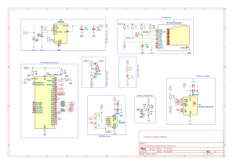
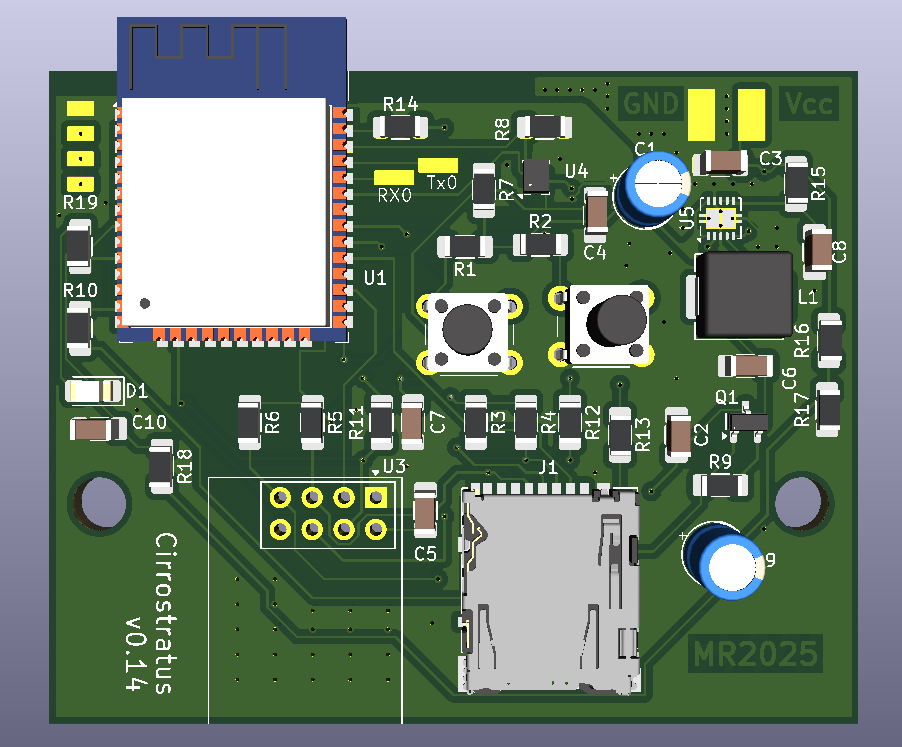

# Cirrostratus – Custom IoT Weather Station

**Cirrostratus** is a fully custom weather station, designed from schematic to PCB layout, optimized for low power consumption and reliable data logging. The project is in its final stage, with PCB ready for production.

## Features
- **ESP32 WROOM32** – main controller
- **BMP280** – atmospheric pressure sensor
- **Pins for external temperature and humidity sensor**
- **microSD card** – data logging
- **NRF24L01** – wireless communication
- **3.3V power supply** – optimized for low energy consumption
- **Voltage monitoring via ADC**
- Automatic wake-up every 10 minutes, measurement, data logging, transmission, and return to deep sleep

## Repository Contents
- **Schematic** in SVG format
- **PCB project** in KiCad
- **Gerber files** ready for production

## Visualizations
### Circuit Schematic

### PCB Layout
**Front Side:**  
  

**Back Side:**  
  

## License
This project is licensed under the **MIT License** – you are free to use, modify, and integrate it into your own projects, provided credit is given to the author.
